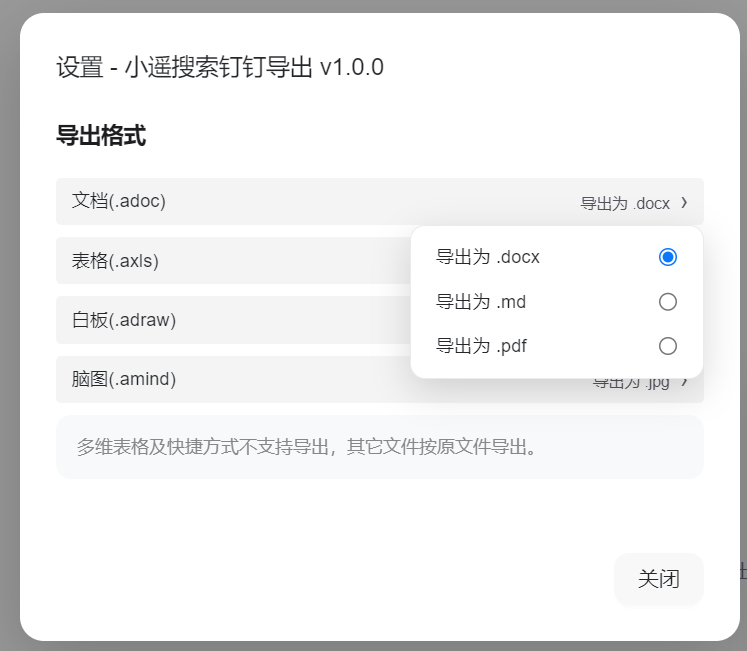

# 小遥搜索钉钉导出工具

[English](README_EN.md) | 简体中文

> 将钉钉文档/知识库批量导出为多种格式的浏览器插件

> **💡 本工具是 [小遥搜索](https://github.com/dtsola/xiaoyaosearch) 生态的扩展工具**
>
> [小遥搜索](https://github.com/dtsola/xiaoyaosearch) —— 听懂你的话、看懂你的图，用 AI 找到本地任何文件。让搜索像聊天一样简单。

  

---

## 作者介绍

  

  <b>dtsola</b> — IT解决方案架构师 | 一人公司实践者

  🌐 <a href="https://www.dtsola.com">个人站点</a> &nbsp;|&nbsp;
  📺 <a href="https://space.bilibili.com/736015">B站</a> &nbsp;|&nbsp;
  💬 微信：dtsola（技术交流 | 商务合作）

  
  &nbsp;&nbsp;&nbsp;&nbsp;&nbsp;&nbsp;
  
  &nbsp;&nbsp;&nbsp;&nbsp;&nbsp;&nbsp;
  

  <small>微信联系 &nbsp;&nbsp;&nbsp;&nbsp;&nbsp;&nbsp;&nbsp;&nbsp; 开发者交流群 &nbsp;&nbsp;&nbsp;&nbsp;&nbsp;&nbsp;&nbsp;&nbsp; 用户交流群</small>

---

## 适用人群

- 👨‍💻 **知识管理爱好者** - 希望将云端文档备份到本地，防止数据丢失
- 💼 **自由职业者** - 需要将钉钉内容迁移到 Obsidian、Logseq 等本地笔记工具
- 🏢 **创业团队 IT 运维** - 负责企业知识库的定期备份和合规归档
- 📝 **技术文档维护者** - 需要将 API 文档导出到本地进行版本控制
- 🎓 **学生用户** - 在 Windows/macOS 等不同平台上都需要使用

---

## 使用场景

### 📦 个人知识备份
将珍贵的钉钉文档备份到本地，即使没有网络也能随时查看，同时避免云端数据丢失风险。

### 🔄 笔记工具迁移
导出为标准 Markdown/.docx/.pdf 等格式，轻松迁移到 Obsidian、Logseq、Notion 等其他知识管理工具。

### 🏛️ 企业知识归档
批量导出整个钉钉知识库，保持原有目录结构，满足企业合规和审计要求。

### 📊 技术文档本地化
将 API 文档、技术规范、设计文档导出到本地，实现离线查阅和版本管理。

### 🚀 离职文档交接
一键导出所有参与过的项目文档，快速完成工作资料交接，避免数据丢失。

---

## 特性

- ✅ 支持单个文档导出
- ✅ 支持批量文档导出
- ✅ 支持文件夹递归导出
- ✅ 支持完整知识库导出
- ✅ 多格式转换（.docx/.md/.pdf/.xlsx/.jpg）
- ✅ 目录结构保持
- ✅ 实时导出进度显示
- ✅ 导出格式自定义配置
- ✅ 友好的错误提示

---

## 功能截图

### 主界面

  

打开插件后自动加载当前页面的文档列表，支持勾选导出。

### 批量导出

  

  

选择多个文档或文件夹，点击"下载选中"即可批量导出。

### 设置界面

  

自定义各类文档的默认导出格式。

### 帮助界面

  

内置使用说明和小遥搜索介绍。

---

## 安装

### 环境要求

- **浏览器**：Chrome 90+ / Edge 90+

### 🚀 安装方式

#### 方式一：GitHub 下载
1. 下载最新版本的 [Release](https://github.com/dtsola/xiaoyaosearch-dingding-export-md/releases)
2. 解压到本地目录
3. 打开浏览器，访问：
   - Chrome: `chrome://extensions/`
   - Edge: `edge://extensions/`
4. 开启"开发者模式"
5. 点击"加载已解压的扩展程序"
6. 选择解压后的目录

#### 方式二：百度网盘下载（国内推荐）
- 链接：https://pan.baidu.com/s/1lDaWjMCRXIT-Sqx9UFjerg?pwd=37ed
- 提取码：37ed

---

## 快速开始

### 1. 安装插件
按照上述说明安装浏览器插件。

### 2. 打开钉钉文档
访问 [钉钉文档](https://alidocs.dingtalk.com/i/desktop/my-space) 或直接打开任意钉钉文档/知识库页面。

### 3. 激活插件
点击浏览器工具栏的插件图标，插件面板将自动显示。

### 4. 选择文档
勾选需要导出的文档或文件夹，支持级联选择。

### 5. 开始导出
点击"下载选中"按钮，选择本地保存目录，等待导出完成。

---

## 使用说明

### 支持的文档类型

| 类型 | 后缀 | 支持的导出格式 |
|------|------|---------------|
| 文档 | .adoc | .docx, .md, .pdf |
| 表格 | .axls | .xlsx |
| 白板 | .adraw | .jpg |
| 脑图 | .amind | .jpg |

### 导出格式说明

#### .docx（推荐）
- 保留最完整的格式和内容
- 支持附件、图片、流程图等
- 适合需要完整文档的场景

#### .md
- 纯文本格式，便于版本控制
- 部分复杂内容会以链接形式保留
- 配合小遥搜索实现本地 AI 搜索

#### .pdf
- 适合分享和打印
- 格式固定，兼容性好

### 设置导出格式

点击右上角 ⚙ 设置按钮，自定义各类文档的默认导出格式。

---

## 常见问题

### 1. 插件无法激活？
确保您正在访问钉钉文档页面（alidocs.dingtalk.com 或 docs.dingtalk.com）。

### 2. 找不到某些文档？
- 多维表格不支持导出
- 快捷方式仅导出快捷方式本身
- 确认您有该文档的访问权限

### 3. Markdown 导出内容不完整？
这是正常现象。钉钉文档有许多功能无法完全在 Markdown 中呈现，建议：
- 重要文档选择 .docx 或 .pdf 格式
- 不支持的内容会以文档链接形式保留

### 4. 导出失败怎么办？
- 检查网络连接是否正常
- 确认文档未被删除或移走
- 重新加载页面后重试

---

## 与小遥搜索配合

本工具导出的文档可以直接导入 [小遥搜索](https://github.com/dtsola/xiaoyaosearch)，实现：

- 🗣️ **自然语言搜索** - 用日常语言描述就能找到文档
- 🖼️ **图片搜索** - 上传图片找到相关文档
- 💬 **对话式交互** - 像聊天一样找到你想要的任何文件

---

## 技术栈

- **核心框架**：Baby（自研轻量级响应式框架）
- **UI 库**：Tailwind CSS v4 + DaisyUI v5（Apple 风格设计）
- **构建工具**：Vite v8 + @crxjs/vite-plugin
- **浏览器扩展**：Chrome Extension Manifest V3

---

## 许可证

[MIT](LICENSE)

---

## 致谢

本项目基于 [ding-doc-downloader](https://github.com/Microanswer/ding-doc-downloader) 进行二次开发，感谢原作者 @Microanswer 的贡献。

在此基础上，本项目进行了以下优化：
- 🎨 **UI 重新设计** - 采用 Apple 风格设计，提升用户体验
- 🔍 **小遥搜索生态集成** - 添加品牌推广和 AI 搜索引导
- 🐛 **问题修复** - 修复钉钉域名变更、文件名处理等问题
- 📦 **构建优化** - 使用 Vite + CRXJS 构建系统

---

## 相关链接

- [小遥搜索](https://github.com/dtsola/xiaoyaosearch) - 本地 AI 搜索工具
- [小遥搜索飞书导出工具](https://github.com/dtsola/xiaoyaosearch-feishu-export-md) - 飞书文档导出工具
- [钉钉开放平台](https://open.dingtalk.com/)
- [钉钉文档](https://alidocs.dingtalk.com/)

---

  <b>小遥搜索钉钉导出工具</b> 
  导出钉钉文档，实现本地 AI 搜索

  <a href="https://github.com/dtsola/xiaoyaosearch">⭐ Star</a> 本项目以支持开发

