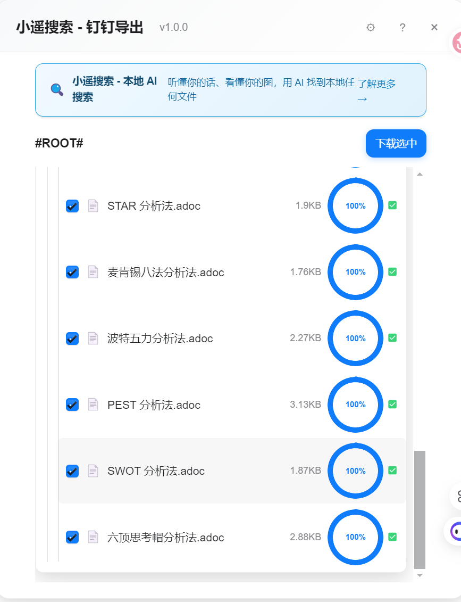

# Xiaoyao DingTalk Export

> Batch export DingTalk documents/wiki to multiple formats as a browser extension

[简体中文](README.md) | English

> **💡 This tool is an extension of [Xiaoyao Search](https://github.com/dtsola/xiaoyaosearch) ecosystem**
>
> [Xiaoyao Search](https://github.com/dtsola/xiaoyaosearch) - Understand your words, see your images, and use AI to find any local file. Make search as simple as chatting.

---

## About Author

  

  <b>dtsola</b> — IT Solution Architect | Solo Practitioner

  🌐 <a href="https://www.dtsola.com">Website</a> &nbsp;|&nbsp;
  📺 <a href="https://space.bilibili.com/736015">Bilibili</a> &nbsp;|&nbsp;
  💬 WeChat: dtsola（Technical | Business）

---

## Target Users

- 👨‍💻 **Knowledge Management Enthusiasts** - Backup cloud documents locally to prevent data loss
- 💼 **Freelancers** - Migrate DingTalk content to Obsidian, Logseq, and other local note-taking tools
- 🏢 **Startup IT Ops** - Responsible for regular backup and compliance archiving of enterprise knowledge bases
- 📝 **Technical Document Maintainers** - Need to export API documents locally for version control
- 🎓 **Students** - Need to use on different platforms like Windows/macOS

---

## Use Cases

### 📦 Personal Knowledge Backup
Backup precious DingTalk documents locally, view anytime without internet, avoid cloud data loss.

### 🔄 Note Tool Migration
Export to standard Markdown/.docx/.pdf formats, easily migrate to Obsidian, Logseq, Notion, and other knowledge management tools.

### 🏛️ Enterprise Knowledge Archiving
Batch export entire DingTalk wiki, maintain original directory structure, meet compliance and audit requirements.

### 📊 Technical Documentation Localization
Export API documentation, technical specs, design documents locally for offline viewing and version management.

### 🚀 Exit Document Handover
One-click export all participated project documents for quick work handover, avoid data loss.

---

## Features

- ✅ Single document export
- ✅ Batch document export
- ✅ Recursive folder export
- ✅ Complete wiki export
- ✅ Multiple format conversion (.docx/.md/.pdf/.xlsx/.jpg)
- ✅ Directory structure preservation
- ✅ Real-time export progress display
- ✅ Custom export format configuration
- ✅ Friendly error prompts

---

## Screenshots

### Main Interface

  

Automatically load document list of current page after opening plugin, support selection for export.

### Batch Export

  

  

  

Select multiple documents or folders, click "Download Selected" to batch export.

### Settings

  

Customize default export format for each document type.

### Help

  

Built-in usage instructions and Xiaoyao Search introduction.

---

## Installation

### Requirements

- **Browser**: Chrome 90+ / Edge 90+

### 🚀 Installation

#### Method 1: GitHub Download
1. Download latest [Release](https://github.com/dtsola/xiaoyaosearch-dingding-export-md/releases)
2. Extract to local directory
3. Open browser and visit:
   - Chrome: `chrome://extensions/`
   - Edge: `edge://extensions/`
4. Enable "Developer mode"
5. Click "Load unpacked"
6. Select the extracted directory

#### Method 2: Baidu NetDisk (For China Users)
- Link: https://pan.baidu.com/s/1lDaWjMCRXIT-Sqx9UFjerg?pwd=37ed
- Extraction Code: 37ed

---

## Quick Start

### 1. Install Plugin
Follow the instructions above to install browser extension.

### 2. Open DingTalk Docs
Visit [DingTalk Docs](https://alidocs.dingtalk.com/i/desktop/my-space) or open any DingTalk document/wiki page.

### 3. Activate Plugin
Click the plugin icon in browser toolbar, plugin panel will appear automatically.

### 4. Select Documents
Check the documents or folders to export, supports cascading selection.

### 5. Start Export
Click "Download Selected" button, choose local save directory, wait for completion.

---

## Usage Guide

### Supported Document Types

| Type | Extension | Export Formats |
|------|-----------|---------------|
| Document | .adoc | .docx, .md, .pdf |
| Spreadsheet | .axls | .xlsx |
| Whiteboard | .adraw | .jpg |
| Mindmap | .amind | .jpg |

### Export Format Description

#### .docx (Recommended)
- Preserves most complete format and content
- Supports attachments, images, flowcharts, etc.
- Suitable for scenarios requiring complete documents

#### .md
- Plain text format, convenient for version control
- Some complex content preserved as links
- Works with Xiaoyao Search for local AI search

#### .pdf
- Suitable for sharing and printing
- Fixed format, good compatibility

### Configure Export Format

Click ⚙ Settings button in top right to customize default export format for each document type.

---

## FAQ

### 1. Plugin cannot activate?
Make sure you're visiting a DingTalk document page (alidocs.dingtalk.com or docs.dingtalk.com).

### 2. Cannot find some documents?
- Multidimensional tables are not supported for export
- Shortcuts only export the shortcut itself
- Confirm you have access permission to the document

### 3. Markdown export incomplete?
This is normal. DingTalk docs have many features that cannot be fully represented in Markdown. It's recommended to:
- Choose .docx or .pdf format for important documents
- Unsupported content preserved as document links

### 4. Export failed?
- Check network connection
- Confirm document not deleted or moved
- Reload page and retry

---

## Integration with Xiaoyao Search

Documents exported by this tool can be directly imported into [Xiaoyao Search](https://github.com/dtsola/xiaoyaosearch) to achieve:

- 🗣️ **Natural Language Search** - Find documents with everyday descriptions
- 🖼️ **Image Search** - Upload images to find related documents
- 💬 **Conversational Interaction** - Find any file like chatting

---

## Tech Stack

- **Core Framework**: Baby (Lightweight reactive framework)
- **UI Library**: Tailwind CSS v4 + DaisyUI v5 (Apple-style design)
- **Build Tool**: Vite v8 + @crxjs/vite-plugin
- **Browser Extension**: Chrome Extension Manifest V3

---

## License

[MIT](LICENSE)

---

## Acknowledgments

This project is based on [ding-doc-downloader](https://github.com/Microanswer/ding-doc-downloader) for secondary development. Thanks to the original author @Microanswer for the contribution.

On this basis, this project has made the following improvements:
- 🎨 **UI Redesign** - Adopt Apple-style design for better user experience
- 🔍 **Xiaoyao Search Integration** - Add brand promotion and AI search guidance
- 🐛 **Bug Fixes** - Fixed DingTalk domain changes, filename handling issues
- 📦 **Build Optimization** - Use Vite + CRXJS build system

---

## Related Links

- [Xiaoyao Search](https://github.com/dtsola/xiaoyaosearch) - Local AI search tool
- [Xiaoyao Feishu Export](https://github.com/dtsola/xiaoyaosearch-feishu-export-md) - Feishu document export tool
- [DingTalk Open Platform](https://open.dingtalk.com/)
- [DingTalk Docs](https://alidocs.dingtalk.com/)

---

  <b>Xiaoyao DingTalk Export</b> 
  Export DingTalk Documents for Local AI Search

  <a href="https://github.com/dtsola/xiaoyaosearch">⭐ Star</a> this project to support development

