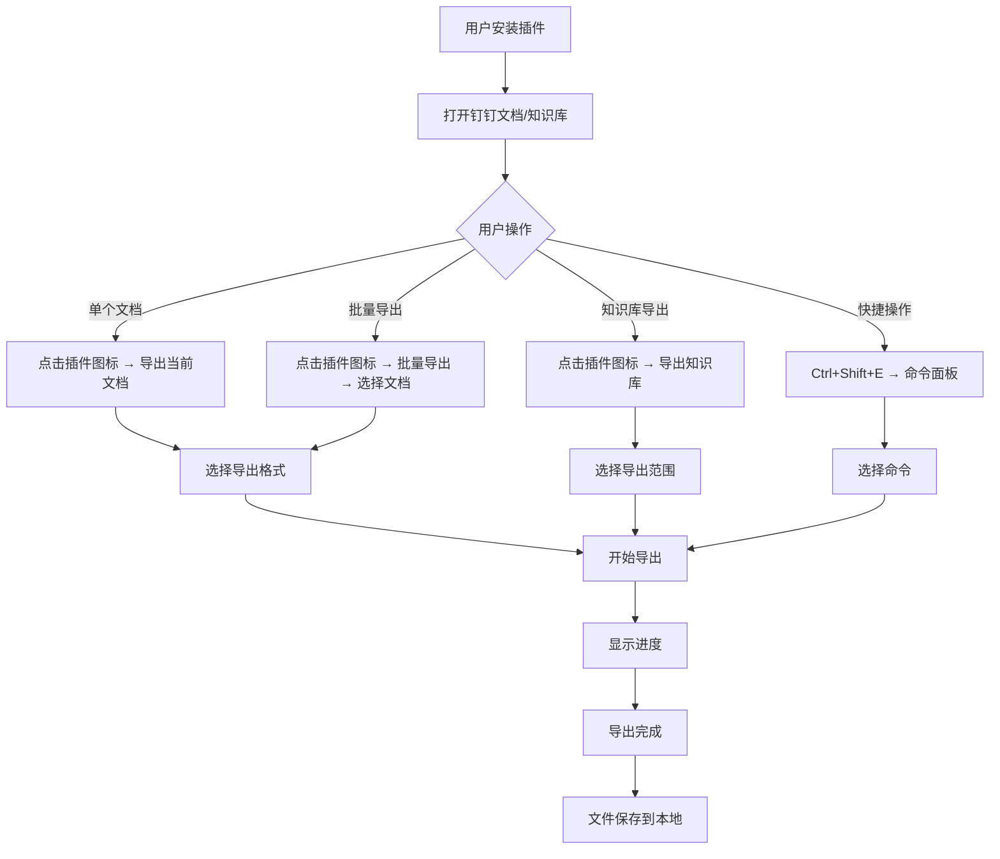
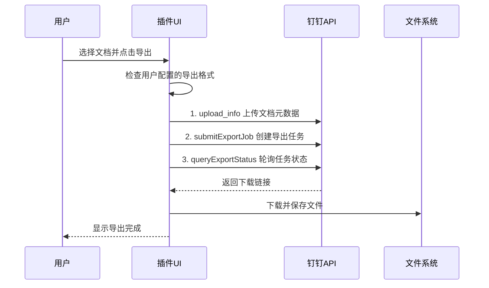
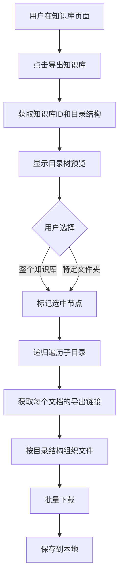

# PRD：小遥搜索钉钉导出工具

## 开发策略

**渐进式开发**：第一版完全复刻老项目 [ding-doc-downloader](../olds/ding-doc-downloader/)，确保核心功能可用；后续版本进行UI/UX优化和功能增强。

---

## 1. 产品定位（一句话）

为 **钉钉知识工作者** 提供 **一键批量导出钉钉文档和知识库** 的 **浏览器插件**，让知识资产真正属于你自己。

### 版本规划

| 版本 | 目标 | 说明 |
|------|------|------|
| **v1.0** | 功能复刻 | 完全复刻 ding-doc-downloader，作为Chrome扩展发布 |
| **v1.5** | UI/UX优化 | 替换为现代框架，重新设计UI和交互 |
| **v2.0** | 功能增强 | 命令面板、导出历史、更多高级功能 |

---

## 2. 用户故事（核心场景）

### 场景1：离职前批量导出文档

- **作为** 即将离职的员工
- **我想要** 一键导出我在钉钉上的所有工作文档
- **以便于** 我能在离职后保留这些工作资料，用于个人作品集或后续工作参考

**接受标准**：
- 用户可以在钉钉文档页面看到插件图标
- 点击插件后可以选择"批量导出当前文档列表"
- 导出过程显示进度条
- 导出完成后文件保存到用户指定目录

---

### 场景2：团队知识库迁移

- **作为** 团队管理员
- **我想要** 导出整个团队知识库，保持原有目录结构
- **以便于** 团队可以从钉钉迁移到其他平台（如Notion、Obsidian）或进行本地归档备份

**接受标准**：
- 用户在钉钉知识库页面可以触发"导出知识库"功能
- 支持选择导出整个知识库或特定文件夹
- 导出后保持原有的目录层级结构
- 支持递归导出子目录

---

### 场景3：定期备份重要文档

- **作为** 知识工作者
- **我想要** 定期将钉钉上的重要文档备份到本地
- **以便于** 即使钉钉账号出现异常或公司政策变更，我的知识资产也是安全的

**接受标准**：
- 用户可以在配置面板设置导出格式偏好（MD、DOCX、PDF等）
- 支持选择性导出（按文档类型、时间范围等）
- 导出时自动转换为通用格式
- 本地处理，数据不上传服务器

---

### 场景4：跨平台知识迁移

- **作为** 独立开发者/自由职业者
- **我想要** 将钉钉文档转换为Markdown格式
- **以便于** 我可以在Obsidian、VS Code等工具中继续编辑和管理

**接受标准**：
- 支持将.adoc文件转换为.md格式
- 转换后保留基本的文档结构（标题、列表、代码块等）
- 支持批量转换多个文档

---

## 3. 功能清单（按版本规划）

### v1.0 功能复刻（完全复刻 ding-doc-downloader）

#### 3.1 基础能力
- [x] **页面检测**：检测当前是否在钉钉文档/知识库页面
- [x] **UI框架**：使用自研Baby框架（与老项目相同）
- [x] **样式框架**：Tailwind CSS + DaisyUI（与老项目相同）
- [x] **构建工具**：Webpack 5（与老项目相同）

#### 3.2 配置管理
- [x] **格式配置**：
  - 文档导出格式：.md / .docx / .pdf（LocalStorage: `dddd-export_adoc_as`）
  - 表格导出格式：.xlsx（LocalStorage: `dddd-export_axls_as`）
  - 白板导出格式：.jpg（LocalStorage: `dddd-export_adraw_as`）
  - 脑图导出格式：.jpg（LocalStorage: `dddd-export_amind_as`）
- [x] **配置持久化**：使用LocalStorage保存

#### 3.3 API封装（复刻 api.js）
- [x] `getDocList(dentryUuid)` - 获取文档列表（支持分页）
- [x] `getSpaceInfo(spaceId)` - 获取空间信息
- [x] `downloadAdoc()` - 导出钉钉文档
- [x] `downloadAxls()` - 导出钉钉表格为 .xlsx
- [x] `downloadAmind()` - 导出脑图为 .jpg
- [x] `downloadBoard()` - 导出白板为 .jpg
- [x] `downloadDocument()` - 下载原始文件

#### 3.4 组件系统（复刻 component/）
- [x] **主组件**（main.js）：显示文档列表
- [x] **文档条目组件**（dentryItem.js）：递归渲染文档树
  - 勾选目录自动勾选所有子项
  - 分页加载（通过 `loadMoreId`）
  - 下载进度显示
- [x] **弹窗组件**（dialog.js）：通用弹窗
- [x] **加载组件**（loading.js）：加载动画
- [x] **设置组件**（settings/cell_radios.js）：单选组件

#### 3.5 工具函数（复刻 util.js）
- [x] 文件名处理（去非法字符）
- [x] 格式化文件大小
- [x] 其他工具函数

#### 3.6 文档转换（复刻 adoc2md.js）
- [x] .adoc 转 .markdown（浏览器端解析）

#### 3.7 Chrome扩展适配
- [ ] **manifest.json**：Chrome扩展配置
- [ ] **Content Script**：在钉钉页面注入
- [ ] **权限请求**：storage、downloads等
- [ ] **图标**：扩展图标设计

---

### v1.5 功能（UI/UX优化）

#### 3.8 框架升级
- [ ] **替换UI框架**：从Baby框架迁移到React/Vue
- [ ] **类型系统**：引入TypeScript
- [ ] **状态管理**：引入状态管理方案

#### 3.9 UI重构
- [ ] **设计系统**：建立统一的视觉规范
- [ ] **组件库**：使用更现代的组件库（Shadcn UI / Ant Design）
- [ ] **暗黑模式**：支持深色主题
- [ ] **响应式设计**：更好的适配不同屏幕

#### 3.10 交互优化
- [ ] **加载状态**：更好的Loading动画
- [ ] **错误提示**：更友好的错误信息
- [ ] **操作反馈**：更清晰的交互反馈
- [ ] **键盘快捷键**：支持常用操作的快捷键

---

### v2.0 功能（高级功能）

#### 3.11 命令面板
- [ ] **快捷键呼出**：Ctrl/Cmd + Shift + E
- [ ] **命令列表**：
  - "导出当前文档"
  - "导出当前文档列表"
  - "导出当前知识库"
  - "打开配置面板"
  - "查看导出历史"

#### 3.12 导出历史
- [ ] **历史记录**：记录每次导出的文档列表和时间
- [ ] **重新导出**：可以基于历史记录重新导出

#### 3.13 高级功能
- [ ] **增量导出**：只导出上次导出后有更新的文档
- [ ] **智能批量选择**：
  - 按创建时间筛选
  - 按文档类型筛选
  - 按作者筛选
- [ ] **导出预览**：导出前预览文件列表

---

### P2功能（未来考虑）

- [ ] **Obsidian格式导出**：生成符合Obsidian规范的Markdown（带双链）
- [ ] **Logseq格式导出**：生成Org-mode格式
- [ ] **云端配置同步**：跨设备同步用户配置
- [ ] **专业版功能**：
  - 无文档数量限制
  - 优先技术支持
  - 高级格式选项
- [ ] **定时备份**：设置定期自动备份任务

---

## 4. 核心流程图

### 4.1 用户使用总流程



### 4.2 文档导出详细流程



### 4.3 知识库导出流程



---

## 5. 页面结构

### v1.0 页面结构（复刻 ding-doc-downloader）

#### 5.1 主界面（文档树）

复刻老项目的UI，使用Tailwind CSS + DaisyUI：

```
┌─────────────────────────────────────────────────────────┐
│  钉钉文档下载工具                          v1.0.0        │
├─────────────────────────────────────────────────────────┤
│                                                         │
│  当前页面：产品团队知识库                               │
│                                                         │
│  设置 📄 导出格式：[Markdown ▼] [保存设置]              │
│                                                         │
│  ┌─────────────────────────────────────────────────┐   │
│  │ ☑️ 📁 研发文档                        [展开]    │   │
│  │   ├─ ☑️ 📁 后端开发             [展开]         │   │
│  │   │   ├─ ☑️ 📄 API设计文档.adoc  导出中... 45%  │   │
│  │   │   └─ ☑️ 📄 数据库设计.adoc    ✅ 已完成      │   │
│  │   └─ ☑️ 📁 前端开发             [展开]         │   │
│  │       └─ ☑️ 📄 组件库文档.adoc      ⏳ 待导出     │   │
│  │ ☑️ 📁 产品文档                        [展开]    │   │
│  │   └─ ☑️ 📄 需求文档.adoc          ⏳ 待导出       │   │
│  │                                                    │   │
│  │          [加载更多...]                             │   │
│  └─────────────────────────────────────────────────┘   │
│                                                         │
│  已选择：4 个文件                                [下载选中] │
└─────────────────────────────────────────────────────────┘
```

**核心交互**（复刻老项目）：
- 勾选目录自动勾选所有子项
- 展开/收起目录
- 底部"加载更多"分页加载
- 点击"下载选中"后选择本地目录，开始下载
- 实时显示每个文件的下载进度

---

#### 5.2 设置弹窗

复刻老项目的单选组件：

```
┌─────────────────────────────────┐
│  设置                            │
├─────────────────────────────────┤
│                                 │
│  📄 文档导出格式                 │
│  ○ Markdown                     │
│  ○ DOCX                         │
│  ○ PDF                          │
│                                 │
│  📊 表格导出格式                 │
│  ○ XLSX                         │
│                                 │
│  🎨 白板导出格式                 │
│  ○ JPG                          │
│                                 │
│  🧠 脑图导出格式                 │
│  ○ JPG                          │
│                                 │
│           [保存] [取消]         │
└─────────────────────────────────┘
```

---

### v1.5 页面结构（UI/UX优化后的设计）

#### 5.3 Chrome扩展弹窗（新增）

**尺寸**：400px × 500px

```
┌─────────────────────────────────┐
│  🎯 小遥搜索 - 钉钉导出工具      │
├─────────────────────────────────┤
│                                 │
│  📍 当前位置：钉钉文档           │
│                                 │
│  ┌───────────────────────────┐  │
│  │ 📄 导出当前文档            │  │
│  ├───────────────────────────┤  │
│  │ 📚 批量导出文档列表        │  │
│  ├───────────────────────────┤  │
│  │ 🗂️  导出知识库             │  │
│  ├───────────────────────────┤  │
│  │ ⚙️  配置设置               │  │
│  └───────────────────────────┘  │
│                                 │
│  💡 提示：Ctrl+Shift+E 快捷呼出 │
└─────────────────────────────────┘
```

---

#### 5.4 批量导出面板（优化版）

**尺寸**：800px × 600px（独立窗口）

```
┌─────────────────────────────────────────────────────────┐
│  📚 批量导出                           [关闭] [导出选中] │
├─────────────────────────────────────────────────────────┤
│  筛选：[全部类型▼] [今天▼] [全部作者▼]    [全选] [反选] │
├─────────────────────────────────────────────────────────┤
│  ☑️ 📄 项目需求文档.adoc              2024-01-15        │
│  ☑️ 📊 Q1数据汇总.axls                2024-01-14        │
│  ☑️ 🎨 产品原型图.adraw               2024-01-13        │
│  ☐ 📄 会议纪要.adoc                  2024-01-12        │
│  ...                                                    │
├─────────────────────────────────────────────────────────┤
│  已选择：3 个文档                         [开始导出]    │
└─────────────────────────────────────────────────────────┘
```

---

#### 5.5 知识库导出面板（优化版）

**尺寸**：800px × 600px（独立窗口）

```
┌─────────────────────────────────────────────────────────┐
│  🗂️ 知识库导出                           [关闭] [开始] │
├─────────────────────────────────────────────────────────┤
│  当前知识库：产品团队知识库                              │
│                                                         │
│  ☑️ 📁 研发文档                                         │
│    ☑️ 📁 后端开发                                       │
│      ☑️ 📄 API设计文档.adoc                             │
│      ☑️ 📄 数据库设计.adoc                              │
│    ☑️ 📁 前端开发                                       │
│      ☑️ 📄 组件库文档.adoc                              │
│  ☑️ 📁 产品文档                                         │
│    ☑️ 📄 需求文档.adoc                                  │
│                                                         │
│  ☐ 仅导出选中文件夹  ☑️ 保持目录结构                     │
│                                                         │
│  预计导出：5 个文档                                      │
└─────────────────────────────────────────────────────────┘
```

---

#### 5.6 配置面板（优化版）

**尺寸**：700px × 500px

```
┌─────────────────────────────────────────────┐
│  ⚙️ 配置设置                      [保存]    │
├─────────────────────────────────────────────┤
│                                             │
│  📄 导出格式                                │
│  ┌─────────────────────────────────────┐   │
│  │ 文档类型：  [Markdown ▼]             │   │
│  │ 表格类型：  [XLSX ▼]                │   │
│  │ 白板类型：  [JPG ▼]                 │   │
│  │ 脑图类型：  [JPG ▼]                 │   │
│  └─────────────────────────────────────┘   │
│                                             │
│  📁 保存设置                                │
│  ┌─────────────────────────────────────┐   │
│  │ 默认保存位置：  [浏览...]            │   │
│  │ 文件命名规则：  ○ 保持原名          │   │
│  │               ○ 添加时间戳          │   │
│  └─────────────────────────────────────┘   │
└─────────────────────────────────────────────┘
```

---

### v2.0 页面结构（新增功能）

#### 5.7 命令面板

**触发方式**：Ctrl/Cmd + Shift + E

```
┌─────────────────────────────────────┐
│  🔍 输入命令或搜索...                │
├─────────────────────────────────────┤
│  📄 导出当前文档          Enter     │
│  📚 批量导出文档列表                │
│  🗂️  导出当前知识库                 │
│  ⚙️  打开配置设置                   │
│  📋 查看导出历史                    │
├─────────────────────────────────────┤
│  💡 提示：使用 ↑↓ 键选择，Enter执行 │
└─────────────────────────────────────┘
```

---

#### 5.8 导出历史页面

```
┌─────────────────────────────────────────────┐
│  📋 导出历史                        [关闭]  │
├─────────────────────────────────────────────┤
│                                             │
│  2024-01-15 14:30                           │
│  └─ 研发文档 (5个文件)         [重新导出]   │
│                                             │
│  2024-01-14 10:20                           │
│  └─ 产品文档 (3个文件)         [重新导出]   │
│                                             │
│  2024-01-13 16:45                           │
│  └─ 会议纪要 (8个文件)         [重新导出]   │
│                                             │
└─────────────────────────────────────────────┘
```

---

## 6. 数据埋点计划

### 6.1 埋点方案

使用 **Google Analytics 4** 或 **自建统计服务**（避免数据上报隐私问题）

### 6.2 事件定义

| 事件名称 | 触发时机 | 关键参数 | 用途 |
|---------|---------|---------|------|
| `plugin_installed` | 用户首次安装插件 | version, source | 了解安装来源和版本分布 |
| `plugin_opened` | 用户打开插件弹窗 | page_type | 了解用户在哪些页面使用 |
| `export_started` | 用户开始导出 | export_type, format, count | 了解导出行为和格式偏好 |
| `export_completed` | 导出完成 | export_type, count, duration | 了解成功率和耗时 |
| `export_failed` | 导出失败 | error_code, file_type | 了解失败原因，优化产品 |
| `format_changed` | 用户修改导出格式 | file_type, new_format | 了解格式偏好 |
| `config_saved` | 用户保存配置 | config_key, config_value | 了解用户配置习惯 |
| `command_executed` | 执行命令面板命令 | command_name | 了解常用命令 |
| `page_injected` | 成功注入到钉钉页面 | page_type | 监控注入成功率 |

### 6.3 用户属性

| 属性名 | 说明 |
|--------|------|
| `user_id` | 匿名用户ID（随机生成） |
| `first_seen` | 首次使用时间 |
| `last_active` | 最后活跃时间 |
| `export_count_total` | 累计导出文档数 |
| `export_count_week` | 本周导出文档数 |
| `preferred_format` | 偏好导出格式 |

### 6.4 转化漏斗

```
安装插件 → 打开插件 → 首次导出 → 重复使用
   100%    →   80%   →   60%   →   40%
```

**关键指标**：
- 首次导出转化率：60%（安装用户中有60%完成首次导出）
- 留存率：40%（用户在一周内再次使用）

---

## 7. 非功能需求

### 7.1 性能要求

| 指标 | 目标值 | 说明 |
|------|--------|------|
| 插件启动时间 | < 500ms | 点击图标到弹窗显示 |
| 页面注入时间 | < 1s | 钉钉页面加载完成到插件功能可用 |
| 单个文档导出 | < 10s | 平均导出时间（取决于文件大小） |
| 批量导出吞吐 | ≥ 3个/分钟 | 并发导出能力 |
| 内存占用 | < 100MB | 插件运行时内存占用 |

### 7.2 兼容性要求

| 类别 | 支持范围 |
|------|---------|
| **浏览器** | Chrome 90+, Edge 90+（优先）<br>Firefox 88+, Safari 15+（后续） |
| **操作系统** | Windows 10+, macOS 11+, Linux |
| **屏幕分辨率** | 最小 1366×768 |
| **钉钉页面** | 钉钉文档 web.dingtalk.com<br>钉钉知识库 |

### 7.3 安全要求

| 要求 | 说明 |
|------|------|
| **最小权限原则** | 只请求必要的浏览器权限 |
| **数据隐私** | 所有数据处理在本地完成，不上传服务器 |
| **HTTPS通信** | 与钉钉API通信使用HTTPS |
| **代码签名** | 发布的扩展包需要签名验证 |
| **无第三方追踪** | 不使用第三方追踪SDK |

### 7.4 可用性要求

| 要求 | 说明 |
|------|------|
| **错误处理** | 所有错误都有友好的错误提示 |
| **操作反馈** | 每个操作都有明确的视觉反馈 |
| **撤销机制** | 配置修改可以撤销 |
| **帮助文档** | 提供详细的使用说明 |
| **快捷键支持** | 常用操作提供快捷键 |

### 7.5 可维护性要求

| 要求 | 说明 |
|------|------|
| **代码规范** | 遵循ESLint + Prettier规范 |
| **模块化设计** | 功能模块解耦，便于维护 |
| **日志记录** | 关键操作记录日志，便于调试 |
| **版本管理** | 遵循语义化版本规范 |
| **自动更新** | 支持Chrome扩展自动更新 |

---

## 8. 技术约束

### 8.1 钉钉API限制

| 限制项 | 说明 | 应对方案 |
|--------|------|---------|
| API调用频率 | 存在速率限制 | 实现队列和重试机制 |
| Cookie依赖 | 需要用户登录态 | 检测登录状态，提示用户 |
| 域名限制 | 部分API有域名限制 | 从钉钉页面发起请求 |
| 格式支持 | 多维表格等不支持 | 提示用户不支持，提供降级方案 |

### 8.2 浏览器扩展限制

| 限制项 | 说明 | 应对方案 |
|--------|------|---------|
| CSP策略 | 内容安全策略限制 | 使用安全的通信方式 |
| 文件系统访问 | 需要用户授权 | 引导用户授权 |
| 跨域请求 | 存在跨域限制 | 使用chrome.permissions请求 |
| 后台运行 | Service Worker限制 | 合理设计后台任务 |

---

## 9. 验收标准

### 9.1 v1.0 验收标准（复刻版本）

#### 功能验收
- [ ] 用户可以从Chrome应用商店安装插件
- [ ] 用户在钉钉文档/知识库页面可以看到插件界面
- [ ] 用户可以浏览文档树结构
- [ ] 用户可以勾选/取消勾选文档和目录
- [ ] 用户可以批量导出选中的文档
- [ ] 用户可以设置导出格式（MD/DOCX/PDF/XLSX/JPG）
- [ ] 导出进度实时显示
- [ ] 导出完成后文件保存到用户选择的目录
- [ ] 错误有友好提示

#### 性能验收
- [ ] 页面注入时间 < 2s
- [ ] 单个文档导出时间 < 10s
- [ ] 内存占用 < 150MB（允许比v1.5略高）

#### 兼容性验收
- [ ] 在Chrome 90+版本正常运行
- [ ] 在Edge 90+版本正常运行
- [ ] 在Windows 10+正常运行
- [ ] 在macOS 11+正常运行

---

### 9.2 v1.5 验收标准（UI/UX优化版）

#### 功能验收
- [ ] 所有v1.0功能正常工作
- [ ] UI更加现代化，交互更加流畅
- [ ] 支持暗黑模式
- [ ] 支持快捷键操作
- [ ] 响应式设计，适配不同屏幕

#### 性能验收
- [ ] 插件启动时间 < 500ms
- [ ] 页面注入时间 < 1s
- [ ] 内存占用 < 100MB

---

### 9.3 v2.0 验收标准（功能增强版）

#### 功能验收
- [ ] 所有v1.5功能正常工作
- [ ] 命令面板功能正常
- [ ] 导出历史功能正常
- [ ] 增量导出功能正常
- [ ] 智能批量选择功能正常

---

## 10. 上线计划（渐进式开发）

### 10.1 v1.0 开发计划（复刻老项目）

**目标**：完全复刻 ding-doc-downloader，作为Chrome扩展发布

**开发时间**：2-3周

```
Week 1: 项目初始化 + 核心代码复刻
  Day 1-2:   Chrome扩展项目搭建
             - 创建 manifest.json
             - 配置 Webpack 构建流程
             - 复刻 Baby 框架（index.js）
  Day 3-4:   复刻核心组件
             - main.js（主组件）
             - dentryItem.js（文档条目组件）
             - dialog.js（弹窗组件）
             - loading.js（加载组件）
  Day 5-7:   复刻 API 封装
             - api.js（钉钉API封装）
             - Http.js（HTTP请求工具）
             - util.js（工具函数）
             - cfg.js（配置管理）

Week 2: 功能完善 + Chrome扩展适配
  Day 8-10:  文档导出功能
             - downloadAdoc()（.adoc → .md/.docx/.pdf）
             - downloadAxls()（.axls → .xlsx）
             - downloadBoard()（.adraw → .jpg）
             - downloadAmind()（.amind → .jpg）
  Day 11-12: 批量导出 + 知识库导出
             - 递归文档树渲染
             - 分页加载（loadMoreId）
             - 进度显示
  Day 13-14: Chrome扩展适配
             - Content Script 注入
             - 权限配置
             - 图标设计

Week 3: 测试 + 发布准备
  Day 15-16: 功能测试
             - 各种文档类型测试
             - 边界情况测试
             - Bug修复
  Day 17-18: 发布准备
             - 应用商店素材（图标、截图、描述）
             - 使用文档编写
             - 隐私政策
  Day 19-21: 发布 + 反馈收集
             - 提交Chrome应用商店审核
             - 等待审核通过
             - 小范围内测
```

---

### 10.2 v1.5 开发计划（UI/UX优化）

**目标**：替换为现代框架，重新设计UI和交互

**开发时间**：3-4周

```
Week 1-2: 框架迁移
  - 从 Baby 框架迁移到 React/Vue
  - 引入 TypeScript
  - 重构组件结构

Week 3: UI重设计
  - 设计系统建立
  - 组件库选择（Shadcn UI / Ant Design）
  - 页面重构

Week 4: 测试 + 发布
  - 功能测试
  - 性能优化
  - 发布 v1.5
```

---

### 10.3 v2.0 开发计划（功能增强）

**目标**：添加高级功能

**开发时间**：4-5周

```
Week 1-2: 新功能开发
  - 命令面板
  - 导出历史
  - 增量导出

Week 3: 交互优化
  - 智能批量选择
  - 导出预览
  - 暗黑模式

Week 4-5: 测试 + 发布
  - 功能测试
  - 用户测试
  - 发布 v2.0
```

---

### 10.4 发布时间表

| 版本 | 开发周期 | 目标上线时间 |
|------|---------|-------------|
| **v1.0** | 2-3周 | 2026-05-01 |
| **v1.5** | 3-4周 | 2026-06-01 |
| **v2.0** | 4-5周 | 2026-07-15 |

---

**总开发时间**：约10-12周
**v1.0 上线时间目标**：2026-05-01

---

## 附录：名词解释

| 术语 | 说明 |
|------|------|
| .adoc | 钉钉文档的专有文件格式 |
| .axls | 钉钉表格的专有文件格式 |
| .adraw | 钉钉白板的专有文件格式 |
| .amind | 钉钉脑图的专有文件格式 |
| 批量导出 | 一次性导出多个文档的功能 |
| 知识库 | 钉钉的团队文档协作空间 |
| 命令面板 | 快捷键呼出的命令执行界面 |
| 注入脚本 | 在网页中插入的JavaScript代码 |
