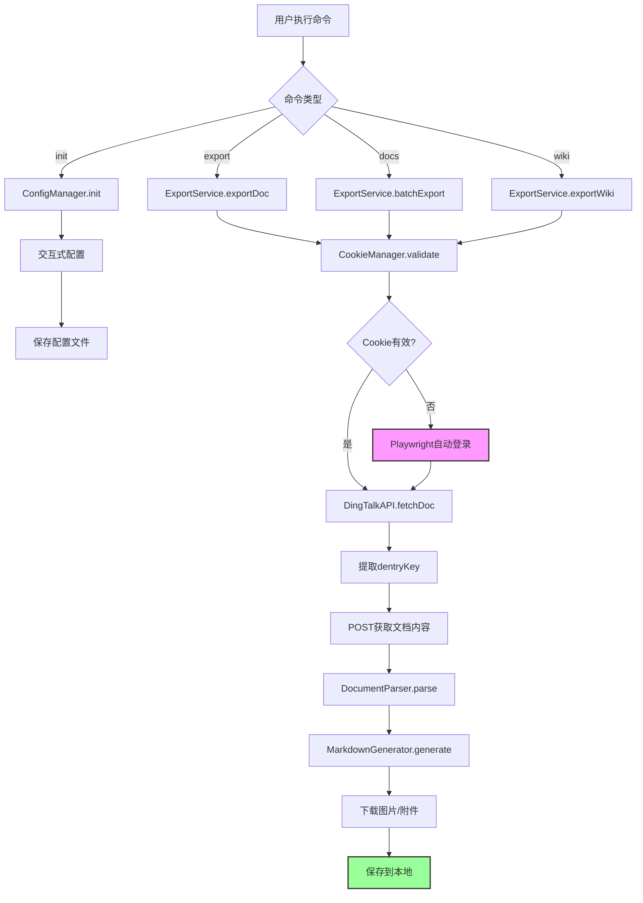
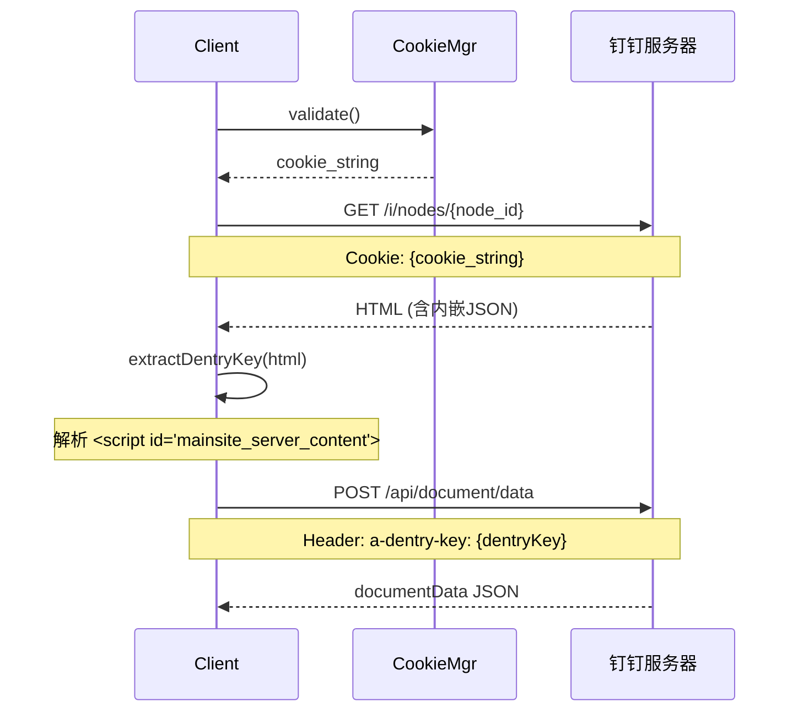

# 技术方案：小遥搜索钉钉导出工具

## 1. 技术选型

### 核心技术栈
- **语言**: TypeScript 5.3+
- **运行时**: Node.js >= 18.0.0
- **包管理**: pnpm 8.x+
- **理由**:
  - 与飞书导出工具保持一致，便于代码复用和维护
  - TypeScript 提供编译时类型安全
  - Node.js 生态丰富，HTTP客户端库成熟

### CLI 框架
- **框架**: Commander.js 11.x
- **交互式配置**: Inquirer.js 9.x
- **进度显示**: cli-progress 3.x
- **理由**:
  - Commander.js 是最流行的 Node.js CLI 框架
  - Inquirer.js 提供优雅的交互式命令行体验
  - cli-progress 支持批量导出时的进度展示

### HTTP 客户端
- **库**: axios 1.x + cheerio 1.x
- **Cookie管理**: tough-cookie 4.x
- **理由**:
  - axios 支持 Promise API 和拦截器
  - cheerio 用于解析 HTML，提取 dentryKey
  - tough-cookie 实现 Cookie 持久化和自动更新

### 文档解析
- **HTML解析**: cheerio 1.x
- **Markdown生成**: 自研（参考飞书工具）
- **理由**:
  - cheerio 轻量高效，类 jQuery API
  - 自研 Markdown 生成器可精确控制输出格式

### Cookie 管理（核心亮点）
- **自动登录**: Playwright 1.40+
- **智能检测**: 自研 Cookie 验证逻辑
- **理由**:
  - 钉钉 Cookie 有效期 7-30 天，需要自动刷新
  - Playwright 实现无头浏览器自动登录
  - 参考老项目的智能 Cookie 管理经验

### 工具库
- **日志**: pino 8.x（高性能日志）
- **配置管理**: cosmiconfig 8.x（支持多格式配置文件）
- **路径处理**: glob 10.x（文件匹配）
- **并发控制**: p-limit 3.x（API 限流）

## 2. 系统架构图

```
┌─────────────────────────────────────────────────────────────────┐
│                         CLI 入口层                              │
│  (Commander.js - dingding-export 命令解析)                      │
└─────────────────────────────┬───────────────────────────────────┘
                              │
┌─────────────────────────────┴───────────────────────────────────┐
│                        命令处理层                               │
│  ┌──────────┬──────────┬──────────┬──────────┬──────────────┐  │
│  │   init   │  export  │   docs   │  folder  │     wiki     │  │
│  └──────────┴──────────┴──────────┴──────────┴──────────────┘  │
└─────────────────────────────┬───────────────────────────────────┘
                              │
┌─────────────────────────────┴───────────────────────────────────┐
│                        业务逻辑层                               │
│  ┌──────────────────┬──────────────────┬────────────────────┐  │
│  │  ConfigManager   │  ExportService   │  CookieManager     │  │
│  │  配置文件管理     │  导出业务逻辑     │  智能Cookie管理    │  │
│  └──────────────────┴──────────────────┴────────────────────┘  │
└─────────────────────────────┬───────────────────────────────────┘
                              │
┌─────────────────────────────┴───────────────────────────────────┐
│                        服务层                                   │
│  ┌──────────────────┬──────────────────┬────────────────────┐  │
│  │  DingTalkAPI     │  DocumentParser  │  MarkdownGenerator │  │
│  │  钉钉API封装      │  文档内容解析     │  Markdown生成     │  │
│  └──────────────────┴──────────────────┴────────────────────┘  │
└─────────────────────────────┬───────────────────────────────────┘
                              │
┌─────────────────────────────┴───────────────────────────────────┐
│                        数据访问层                               │
│  ┌──────────────────┬──────────────────┬────────────────────┐  │
│  │  HttpClient      │  FileSystem      │  Playwright        │  │
│  │  HTTP请求封装     │  文件系统操作     │  自动登录          │  │
│  └──────────────────┴──────────────────┴────────────────────┘  │
└─────────────────────────────────────────────────────────────────┘
```

### 核心流程图



## 3. 核心模块设计

### 3.1 目录结构

```
xiaoyaosearch-dingding-export/
├── src/
│   ├── cli/                    # CLI 入口
│   │   ├── index.ts            # 主入口
│   │   ├── commands/           # 命令处理
│   │   │   ├── init.ts         # 初始化配置
│   │   │   ├── export.ts       # 导出命令
│   │   │   ├── docs.ts         # 批量导出
│   │   │   ├── folder.ts       # 文件夹导出
│   │   │   ├── wiki.ts         # 知识库导出
│   │   │   └── config.ts       # 配置管理
│   │   └── utils/              # CLI 工具
│   │       └── progress.ts     # 进度显示
│   │
│   ├── core/                   # 核心业务
│   │   ├── ConfigManager.ts    # 配置管理器
│   │   ├── ExportService.ts    # 导出服务
│   │   └── CookieManager.ts    # Cookie管理器 ⭐
│   │
│   ├── api/                    # API 层
│   │   ├── DingTalkAPI.ts      # 钉钉API封装
│   │   └── HttpClient.ts       # HTTP客户端
│   │
│   ├── parsers/                # 解析器
│   │   ├── DocumentParser.ts   # 文档解析
│   │   ├── WikiParser.ts       # 知识库解析
│   │   └── ImageParser.ts      # 图片解析
│   │
│   ├── generators/             # 生成器
│   │   └── MarkdownGenerator.ts # Markdown生成
│   │
│   ├── utils/                  # 工具函数
│   │   ├── file.ts             # 文件操作
│   │   ├── logger.ts           # 日志
│   │   └── concurrency.ts      # 并发控制
│   │
│   └── types/                  # 类型定义
│       ├── config.ts           # 配置类型
│       ├── document.ts         # 文档类型
│       └── api.ts              # API类型
│
├── bin/                        # 可执行文件
│   └── dingding-export         # CLI入口
│
├── templates/                  # 模板文件
│   └── config-template.json    # 配置模板
│
├── tests/                      # 测试
│   ├── unit/                   # 单元测试
│   └── integration/            # 集成测试
│
├── package.json
├── tsconfig.json
└── README.md
```

### 3.2 核心类设计

#### CookieManager（智能 Cookie 管理）

```typescript
/**
 * 智能Cookie管理器
 * 参考老项目的smart-cookie.ts实现
 */
export class CookieManager {
  private cookiePath: string;
  private cookieJar: CookieJar;

  /**
   * 验证Cookie是否有效
   */
  async validate(): Promise<boolean>;

  /**
   * 获取有效的Cookie字符串
   */
  getCookie(): Promise<string>;

  /**
   * 使用Playwright自动登录获取新Cookie
   */
  async refreshWithPlaywright(): Promise<void>;

  /**
   * 保存Cookie到本地
   */
  private saveCookie(): void;

  /**
   * 从本地加载Cookie
   */
  private loadCookie(): void;
}
```

#### DingTalkAPI（钉钉 API 封装）

```typescript
/**
 * 钉钉API封装
 * 参考老项目的两阶段API调用模式
 */
export class DingTalkAPI {
  private httpClient: HttpClient;
  private cookieManager: CookieManager;

  /**
   * 获取文档页面（提取dentryKey）
   * GET /i/nodes/{node_id}
   */
  async fetchDocumentPage(nodeId: string): Promise<string>;

  /**
   * 提取dentryKey
   * 从HTML的 <script id="mainsite_server_content"> 中提取
   */
  extractDentryKey(html: string): string;

  /**
   * 获取文档内容
   * POST /api/document/data
   * Header: a-dentry-key
   */
  async fetchDocumentData(dentryKey: string): Promise<DocumentData>;

  /**
   * 下载图片
   */
  async downloadImage(url: string): Promise<Buffer>;
}
```

#### MarkdownGenerator（Markdown 生成器）

```typescript
/**
 * Markdown生成器
 * 将钉钉文档内容转换为标准Markdown格式
 */
export class MarkdownGenerator {
  /**
   * 生成Markdown文档
   */
  generate(data: DocumentData, options: GenerateOptions): string;

  /**
   * 转换段落
   */
  private parseParagraph(node: ContentNode): string;

  /**
   * 转换代码块
   */
  private parseCodeBlock(node: CodeNode): string;

  /**
   * 转换表格
   */
  private parseTable(node: TableNode): string;

  /**
   * 转换图片
   */
  private parseImage(node: ImageNode): string;
}
```

## 4. 钉钉API调用方案

### 4.1 认证方式

**采用 Cookie 认证**（网页API爬取方式）

**理由：**
- 钉钉开放平台 API 权限申请严格，需要企业认证
- Cookie 方式可以绕过企业认证限制
- 参考老项目已验证的可行性

**实现方式：**
```typescript
// Cookie 存储
~/.dingding-export/
├── cookies.json          # Cookie数据
└── config.json           # 配置文件

// Cookie 结构
{
  "cookies": [
    {
      "name": "session",
      "value": "xxx",
      "domain": ".dingtalk.com",
      "path": "/",
      "expires": "2026-05-07T12:00:00.000Z"
    }
  ],
  "lastUpdate": "2026-04-07T10:30:00.000Z"
}
```

### 4.2 API 调用流程

**两阶段请求模式**（参考老项目经验）：



### 4.3 关键请求参数

#### GET 请求（获取页面）
```http
GET /i/nodes/{node_id}
Host: alidocs.dingtalk.com
Cookie: {cookie_string}
User-Agent: Mozilla/5.0 ...
```

#### POST 请求（获取文档内容）
```http
POST /api/document/data
Host: alidocs.dingtalk.com
Cookie: {cookie_string}
a-dentry-key: {dentryKey}
Content-Type: application/json

{
  "dentryKey": "{dentryKey}"
}
```

## 5. 配置管理方案

### 5.1 配置文件结构

```json
// ~/.dingding-export/config.json
{
  "profiles": {
    "default": {
      "outputDir": "./output",
      "concurrency": 5,
      "downloadImages": true,
      "downloadAssets": true,
      "incrementalMode": false
    }
  },
  "currentProfile": "default"
}
```

### 5.2 配置管理

使用 **cosmiconfig** 库实现多格式配置支持：

- 优先级：命令行参数 > 环境变量 > 配置文件
- 支持的配置文件格式：
  - `.dingding-exportrc`
  - `.dingding-exportrc.json`
  - `.dingding-export.config.js`
  - `dingding-export` 字段在 `package.json`

## 6. 数据存储方案

### 6.1 输出文件结构

```
output/
├── docs/                        # 单个文档
│   └── {node_id}.md
│
├── batch/                       # 批量导出
│   ├── {timestamp}/
│   │   ├── {node_id}.md
│   │   ├── {node_id}.md
│   │   └── assets/
│   │       ├── images/
│   │       └── files/
│
└── wiki/                        # 知识库
    └── {wiki_id}/
        ├── index.md             # 知识库索引
        └── {node_token}/        # 目录结构
            └── *.md
```

### 6.2 增量导出状态

```json
// output/.state.json
{
  "lastExport": "2026-04-07T10:30:00.000Z",
  "exportedDocs": {
    "node_id_1": "2026-04-07T10:00:00.000Z",
    "node_id_2": "2026-04-07T10:05:00.000Z"
  }
}
```

## 7. 错误处理与重试

### 7.1 错误类型

| 错误类型 | HTTP状态码 | 处理方式 |
|---------|-----------|---------|
| Cookie失效 | 401/403 | 自动重新登录 |
| API限流 | 429 | 指数退避重试 |
| 网络超时 | - | 重试3次 |
| 文档不存在 | 404 | 记录日志，跳过 |

### 7.2 重试策略

```typescript
// 使用 p-limit 和 axios-retry 实现
const retryConfig = {
  retries: 3,
  retryDelay: (retryCount) => {
    return Math.pow(2, retryCount) * 1000; // 指数退避
  },
  retryCondition: (error) => {
    return error.response?.status === 429 ||
           error.code === 'ECONNABORTED';
  }
};
```

## 8. 性能优化

### 8.1 并发控制

```typescript
import pLimit from 'p-limit';

const limit = pLimit(concurrency); // 默认5

// 批量导出时使用并发控制
const tasks = docIds.map(id =>
  limit(() => exportDocument(id))
);
await Promise.all(tasks);
```

### 8.2 缓存策略

- **Cookie缓存**: 本地存储，7天有效期
- **文档缓存**: 增量导出模式下，基于修改时间判断
- **图片缓存**: 按URL的MD5哈希存储

## 9. 安全考虑

### 9.1 Cookie 安全

- Cookie 文件权限设置为仅所有者可读写（600）
- Cookie 不输出到日志
- 支持 `.gitignore` 忽略配置文件

### 9.2 输入验证

- 文档ID格式验证
- URL白名单验证
- 路径遍历防护

## 10. 部署方案

### 10.1 npm 发布

```bash
# 包名
xiaoyaosearch-dingding-export

# 发布命令
npm publish

# 安装使用
npm install -g xiaoyaosearch-dingding-export
dingding-export init
```

### 10.2 版本管理

遵循语义化版本（Semantic Versioning）：
- **MAJOR**: 不兼容的API变更
- **MINOR**: 向后兼容的功能新增
- **PATCH**: 向后兼容的问题修复

## 11. 测试方案

### 11.1 单元测试

使用 **Vitest** 框架：
- 核心类方法测试
- Mock HTTP请求
- 配置管理测试

### 11.2 集成测试

- 端到端CLI命令测试
- 真实钉钉文档导出测试

## 12. 监控与日志

### 12.1 日志级别

```typescript
import pino from 'pino';

const logger = pino({
  level: process.env.LOG_LEVEL || 'info',
  transport: {
    target: 'pino-pretty',
    options: {
      colorize: true
    }
  }
});
```

### 12.2 错误上报

可选集成 Sentry：
```typescript
import * as Sentry from '@sentry/node';

Sentry.init({
  dsn: process.env.SENTRY_DSN,
  environment: process.env.NODE_ENV
});
```

## 13. 技术风险与应对

| 风险 | 影响 | 概率 | 应对方案 |
|------|------|------|---------|
| 钉钉API变更 | 高 | 中 | 版本隔离，快速适配 |
| Cookie机制变化 | 高 | 低 | Playwright自动登录可适应 |
| 文档格式不兼容 | 中 | 中 | 增加格式转换层 |
| OSS加密文档 | 中 | 低 | 提示用户，跳过处理 |

## 14. 开发环境

### 14.1 开发工具

- **IDE**: VSCode
- **代码规范**: ESLint + Prettier
- **Git钩子**: Husky + lint-staged
- **提交规范**: Commitlint

### 14.2 项目管理

- **代码仓库**: GitHub
- **Issue管理**: GitHub Issues
- **文档**: GitHub Wiki / docs目录

---

**技术债务记录：**
- [ ] 优化大文档解析性能
- [ ] 支持更多文档格式（PDF、HTML）
- [ ] 增加导出进度持久化
- [ ] 支持自定义Markdown模板

**版本**: v1.0.0
**文档日期**: 2026-04-07
