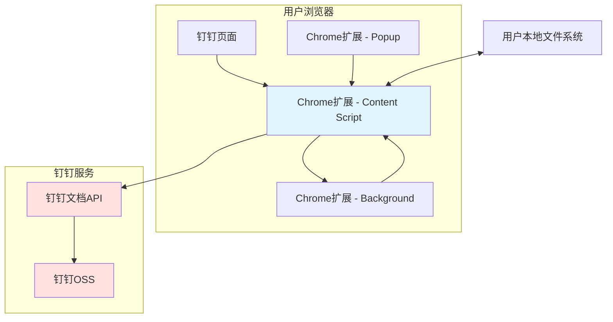
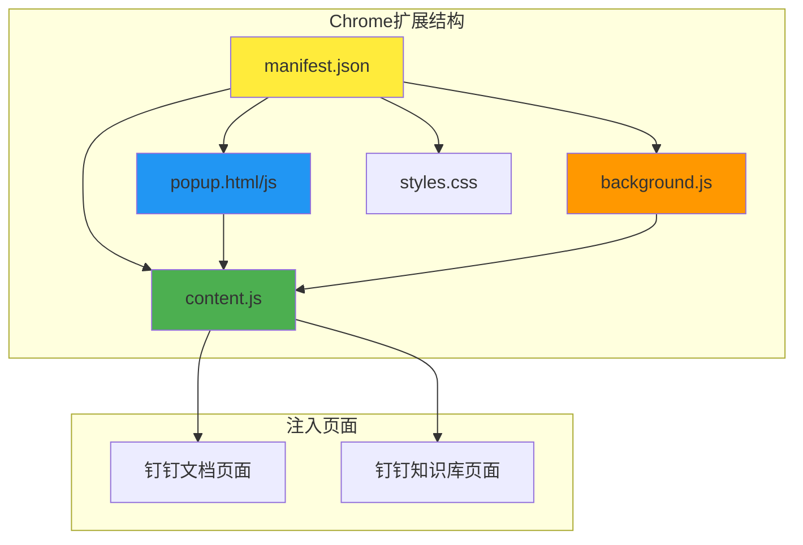
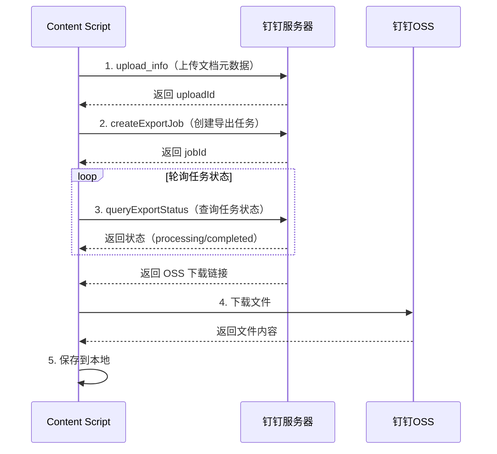
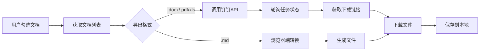
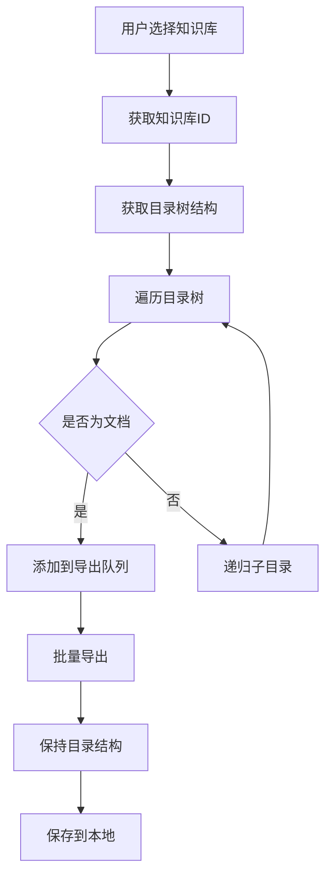
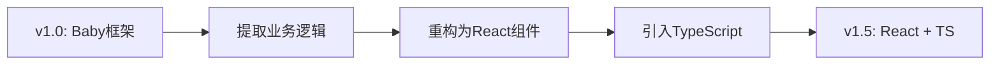
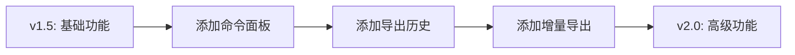

# 技术方案：小遥搜索钉钉导出工具

## 1. 技术选型（按版本规划）

### 1.1 v1.0 技术选型（复刻老项目）

**原则**：完全复刻 [ding-doc-downloader](https://github.com/Microanswer/ding-doc-downloader) 的技术栈，确保快速上线。

#### 前端

| 技术 | 版本 | 用途 | 选择理由 |
|------|------|------|---------|
| **JavaScript** | ES6+ | 主要开发语言 | 与老项目一致 |
| **Baby 框架** | 1.0（自研） | 响应式框架 | 老项目自研，轻量级（~400行），类似Vue.js |
| **Vite** | 5.x | 构建工具 | 比 Webpack 更快，HMR 更好，配置更简洁 |
| **@crxjs/vite-plugin** | latest | Chrome扩展插件 | 专门用于Chrome扩展开发的Vite插件 |
| **Tailwind CSS** | 4.x | CSS 框架 | 与老项目一致 |
| **DaisyUI** | 5.x | UI 组件库 | 与老项目一致 |
| **PostCSS** | 8.x | CSS 处理器 | 与老项目一致 |

#### Chrome扩展

| 技术 | 版本 | 用途 | 选择理由 |
|------|------|------|---------|
| **Manifest V3** | - | 扩展配置 | Chrome最新标准 |
| **Content Script** | - | 页面注入 | 在钉钉页面注入功能 |
| **chrome.storage** | - | 配置持久化 | 替代 LocalStorage |
| **chrome.downloads** | - | 文件下载 | 管理下载任务 |

---

### 1.2 v1.5 技术选型（UI/UX优化）

**原则**：替换为现代框架，提升开发体验和代码质量。

#### 前端

| 技术 | 版本 | 用途 | 选择理由 |
|------|------|------|---------|
| **TypeScript** | 5.x | 类型系统 | 提升代码质量，减少运行时错误 |
| **React** | 18.x | UI框架 | 生态成熟，社区活跃，便于招聘 |
| **Vite** | 5.x | 构建工具 | 比 Webpack 更快，开发体验更好 |
| **Tailwind CSS** | 4.x | CSS 框架 | 继续使用，已有经验 |
| **Shadcn UI** | latest | UI 组件库 | 现代化设计，可定制性强 |
| **Zustand** | latest | 状态管理 | 轻量级，API简洁 |
| **React Router** | latest | 路由管理 | Chrome扩展内路由 |

---

### 1.3 v2.0 技术选型（功能增强）

**原则**：在v1.5基础上，添加高级功能。

#### 新增技术

| 技术 | 版本 | 用途 | 选择理由 |
|------|------|------|---------|
| **HotKey.js** | latest | 快捷键管理 | 命令面板快捷键 |
| **IndexedDB** | - | 本地数据库 | 存储导出历史记录 |
| **Web Workers** | - | 后台任务 | 增量导出的文件比对 |

---

## 2. 系统架构图

### 2.1 整体架构



### 2.2 Chrome扩展架构



---

## 3. 核心模块设计

### 3.1 v1.0 模块结构（复刻老项目）

```
xiaoyaosearch-dingtalk-export/
├── manifest.json              # Chrome扩展配置
├── vite.config.js            # Vite配置（替代Webpack）
├── tailwind.config.js        # Tailwind配置
├── postcss.config.js         # PostCSS配置
├── public/                    # 静态资源
│   ├── icon16.png
│   ├── icon48.png
│   ├── icon128.png
│   └── logo.png
├── src/
│   ├── content/               # Content Script（注入到钉钉页面）
│   │   ├── index.js          # 入口文件
│   │   ├── main.js           # 主组件
│   │   ├── framework/        # Baby 框架
│   │   │   └── baby.js       # 响应式框架核心
│   │   ├── components/       # 组件
│   │   │   ├── dentryItem.js # 文档条目组件
│   │   │   ├── dialog.js     # 弹窗组件
│   │   │   ├── loading.js    # 加载组件
│   │   │   └── settings/     # 设置组件
│   │   │       └── cell_radios.js
│   │   ├── api/              # API封装
│   │   │   ├── api.js        # 钉钉API核心
│   │   │   └── http.js       # HTTP请求工具
│   │   ├── utils/            # 工具函数
│   │   │   ├── util.js       # 通用工具
│   │   │   ├── cfg.js        # 配置管理
│   │   │   └── adoc2md.js    # 文档转换
│   │   └── styles/           # 样式
│   │       └── main.css      # 主样式
│   ├── popup/                # 扩展弹窗（可选）
│   │   ├── index.html
│   │   ├── index.js
│   │   └── index.css
│   └── background/           # 后台脚本（v2.0新增）
│       └── index.js
├── dist/                     # Vite构建输出
└── package.json
```

### 3.2 核心模块说明

#### 3.2.1 Baby 框架（framework/baby.js）

复刻老项目的自研响应式框架，核心功能：

```javascript
// 响应式系统
class Baby {
  // 数据劫持
  observe(data) { ... }

  // 组件注册
  component(name, component) { ... }

  // 虚拟DOM
  h(tag, props, children) { ... }

  // 生命周期
  created() { ... }
  mounted() { ... }

  // watch 机制
  watch(key, callback) { ... }
}
```

**特点**：
- 轻量级（~400行）
- 类似 Vue.js 的 API
- 支持组件嵌套和 props 传递

---

#### 3.2.2 API 封装（api/api.js）

钉钉API核心封装，复刻老项目的 api.js：

| 函数 | 功能 | 实现方式 |
|------|------|---------|
| `getDocList(dentryUuid)` | 获取文档列表 | 钉钉GraphQL API |
| `getSpaceInfo(spaceId)` | 获取空间信息 | 钉钉GraphQL API |
| `downloadAdoc(id, format)` | 导出文档 | upload_info → submitExportJob → queryExportStatus |
| `downloadAxls(id)` | 导出表格 | upload_info → submitExportJob → queryExportJobInfo |
| `downloadBoard(id)` | 导出白板 | upload_info → submitExportJob |
| `downloadMind(id)` | 导出脑图 | upload_info → submitExportJob |
| `downloadDocument(id)` | 下载原始文件 | 直接下载 |

**导出流程**（以 .adoc → .pdf 为例）：



---

#### 3.2.3 文档转换（utils/adoc2md.js）

浏览器端 .adoc 转 .markdown：

```javascript
// 转换流程
function adocToMarkdown(adocContent) {
  // 1. 解析 .adoc 结构
  const doc = parseAdoc(adocContent);

  // 2. 转换为 Markdown
  return {
    title: doc.title,
    content: convertBlocks(doc.blocks),
    images: extractImages(doc),      // 需要单独下载
    attachments: extractAttachments(doc) // 需要单独下载
  };
}

// 支持的块类型转换
const blockConverters = {
  'heading': (block) => `#${'#'.repeat(block.level - 1)} ${block.text}\n\n`,
  'paragraph': (block) => `${block.text}\n\n`,
  'code': (block) => `\`\`\`${block.lang}\n${block.code}\n\`\`\`\n\n`,
  'list': (block) => convertList(block),
  'table': (block) => convertTable(block),
  'image': (block) => `\n\n`
};
```

**限制**：
- 附件、流程图等内容会丢失
- 复杂格式可能转换不完整
- 仅支持基本文档结构

---

#### 3.2.4 配置管理（utils/cfg.js）

使用 LocalStorage 存储配置：

```javascript
// 配置项
const CONFIG_KEYS = {
  ADOC_FORMAT: 'dddd-export_adoc_as',    // 文档导出格式
  AXLS_FORMAT: 'dddd-export_axls_as',    // 表格导出格式
  ADRAW_FORMAT: 'dddd-export_adraw_as',  // 白板导出格式
  AMIND_FORMAT: 'dddd-export_amind_as'   // 脑图导出格式
};

// API
const cfg = {
  get(key) { return localStorage.getItem(key); },
  set(key, value) { localStorage.setItem(key, value); },
  getAdocFormat() { return this.get(CONFIG_KEYS.ADOC_FORMAT) || 'md'; },
  setAdocFormat(format) { this.set(CONFIG_KEYS.ADOC_FORMAT, format); },
  // ... 其他方法
};
```

---

## 4. Chrome扩展配置

### 4.1 manifest.json（v1.0）

```json
{
  "manifest_version": 3,
  "name": "小遥搜索钉钉导出工具",
  "version": "1.0.0",
  "description": "一键批量导出钉钉文档和知识库",
  "icons": {
    "16": "public/icon16.png",
    "48": "public/icon48.png",
    "128": "public/icon128.png"
  },
  "permissions": [
    "storage",
    "downloads",
    "activeTab"
  ],
  "host_permissions": [
    "https://*.dingtalk.com/*",
    "https://*.alidocs.dingtalk.com/*"
  ],
  "content_scripts": [
    {
      "matches": [
        "https://*.dingtalk.com/*",
        "https://*.alidocs.dingtalk.com/*"
      ],
      "js": ["dist/content.js"],
      "css": ["dist/content.css"],
      "run_at": "document_idle"
    }
  ],
  "action": {
    "default_popup": "popup.html",
    "default_icon": {
      "16": "public/icon16.png",
      "48": "public/icon48.png"
    }
  }
}
```

### 4.2 权限说明

| 权限 | 用途 | 必要性 |
|------|------|--------|
| `storage` | 存储用户配置 | 必需 |
| `downloads` | 管理文件下载 | 必需 |
| `activeTab` | 获取当前页面信息 | 必需 |
| `host_permissions` | 调用钉钉API | 必需 |

---

## 5. 数据流设计

### 5.1 文档导出数据流



### 5.2 知识库导出数据流



---

## 6. API接口设计（钉钉API）

### 6.1 GraphQL API

老项目通过调用钉钉的 GraphQL API 获取文档信息：

```javascript
// 获取文档列表
const GET_DOC_LIST = `
  query($dentryUuid: String, $pageSize: Int) {
    getDocList(dentryUuid: $dentryUuid, pageSize: $pageSize) {
      items {
        dentryId
        dentryType
        name
        createdAt
        updatedAt
        ... on Doc {
          latestVersion {
            exportToken
          }
        }
      }
      hasMore
      loadMoreId
    }
  }
`;

// 获取空间信息
const GET_SPACE_INFO = `
  query($spaceId: String) {
    getSpaceInfo(spaceId: $spaceId) {
      spaceId
      name
      description
    }
  }
`;
```

### 6.2 导出API

| API | 用途 | 请求方法 |
|------|------|---------|
| `/union/upload_info` | 上传文档元数据 | POST |
| `/union/export/createExportJob` | 创建PDF导出任务 | POST |
| `/union/export/submitExportJob` | 创建DOCX/XLSX导出任务 | POST |
| `/union/export/queryExportStatus` | 查询PDF导出状态 | POST |
| `/union/export/queryExportJobInfo` | 查询DOCX/XLSX导出状态 | POST |

### 6.3 请求示例（.adoc → .pdf）

```javascript
// 步骤1: upload_info
async function exportToPdf(docId) {
  const uploadInfo = await fetch('/union/upload_info', {
    method: 'POST',
    headers: {
      'Content-Type': 'application/json',
    },
    body: JSON.stringify({
      docId: docId,
      exportType: 'pdf'
    })
  });

  // 步骤2: createExportJob
  const job = await fetch('/union/export/createExportJob', {
    method: 'POST',
    headers: {
      'Content-Type': 'application/json',
    },
    body: JSON.stringify({
      uploadId: uploadInfo.uploadId,
      exportOptions: {
        format: 'pdf'
      }
    })
  });

  // 步骤3: queryExportStatus（轮询）
  let status = 'processing';
  while (status === 'processing') {
    await sleep(1000);
    const result = await fetch('/union/export/queryExportStatus', {
      method: 'POST',
      body: JSON.stringify({ jobId: job.jobId })
    });
    status = result.status;
  }

  // 步骤4: 下载文件
  if (status === 'completed') {
    const downloadUrl = result.downloadUrl;
    return downloadFile(downloadUrl);
  }
}
```

---

## 7. 第三方服务

v1.0 不依赖任何第三方服务，所有数据处理在本地完成。

| 类别 | v1.0 | v1.5 | v2.0 |
|------|------|------|------|
| **CDN** | 不需要 | GitHub Pages | GitHub Pages |
| **分析** | 无 | Google Analytics | Plausible（隐私友好） |
| **错误监控** | 无 | Sentry | Sentry |
| **更新服务** | Chrome Web Store | Chrome Web Store | Chrome Web Store |

---

## 8. 技术风险

| 风险 | 影响 | 概率 | 应对方案 |
|------|------|------|---------|
| **钉钉API变更** | 高 | 中 | 1. 持续监控钉钉更新<br>2. 提供多个导出口<br>3. 快速适配机制 |
| **Cookie依赖** | 高 | 中 | 1. 检测登录状态<br>2. 提示用户重新登录<br>3. 支持手动输入Cookie |
| **浏览器兼容性** | 中 | 低 | 1. 优先支持Chrome/Edge<br>2. 明确最低版本要求<br>3. 逐步支持其他浏览器 |
| **文件格式解析失败** | 中 | 低 | 1. 提供详细错误日志<br>2. 降级方案（下载原格式）<br>3. 用户反馈渠道 |
| **Chrome应用商店审核** | 中 | 低 | 1. 严格遵循隐私政策<br>2. 不请求多余权限<br>3. 明确数据使用说明 |
| **老项目代码质量** | 中 | 高 | 1. v1.0快速复刻<br>2. v1.5重构升级<br>3. 逐步替换老代码 |
| **Baby框架维护成本** | 中 | 高 | 1. v1.0临时使用<br>2. v1.5迁移到React<br>3. 不在Baby上投入过多精力 |

---

## 9. 性能优化

### 9.1 导出性能

| 优化项 | 方案 | 预期效果 |
|--------|------|---------|
| **并发控制** | 限制同时导出的文档数量（3个） | 避免浏览器崩溃 |
| **分页加载** | 文档列表分页加载 | 减少初始加载时间 |
| **增量导出** | 只导出有更新的文档 | 减少重复导出 |
| **缓存机制** | 缓存已导出的文档 | 避免重复下载 |

### 9.2 内存优化

| 优化项 | 方案 | 预期效果 |
|--------|------|---------|
| **虚拟滚动** | 大列表使用虚拟滚动 | 减少DOM节点 |
| **图片懒加载** | 文档树图标懒加载 | 减少初始内存占用 |
| **清理机制** | 导出完成后清理缓存 | 释放内存 |

---

## 10. 安全考虑

### 10.1 数据隐私

- ✅ 所有数据处理在本地完成，不上传服务器
- ✅ 不收集用户的文档内容
- ✅ 不收集用户的钉钉账号信息
- ✅ 使用 Chrome Storage API 存储配置（加密）

### 10.2 权限最小化

- ✅ 只请求必要的权限
- ✅ 使用 `activeTab` 而非 `tabs` 权限
- ✅ 明确权限用途说明

### 10.3 通信安全

- ✅ 所有API调用使用 HTTPS
- ✅ 验证钉钉域名，防止中间人攻击
- ✅ 不在代码中硬编码敏感信息

---

## 11. 开发环境

### 11.1 本地开发

```bash
# 安装依赖
npm install

# 开发模式（v1.0 - Vite + HMR）
npm run dev
# → 自动启动Vite开发服务器
# → 修改代码后自动刷新扩展

# 构建
npm run build
# → 输出到 dist/ 目录
# → 在Chrome中加载 dist/ 目录作为未打包的扩展

# 打包Chrome扩展（用于发布）
npm run package
# → 生成 .zip 文件，用于上传到Chrome应用商店
```

**Vite 开发模式的优势**：
- ⚡ **极快的HMR**：修改代码后几乎立即看到效果
- 🔧 **配置简洁**：相比Webpack更少的配置
- 📦 **优化的构建**：生产构建速度更快

**开发流程**：
1. 运行 `npm run dev` 启动开发服务器
2. 在 Chrome 中打开 `chrome://extensions/`
3. 开启"开发者模式"
4. 点击"加载已解压的扩展程序"，选择 `dist/` 目录
5. 修改代码后，Vite 会自动重新构建，Chrome 会自动刷新扩展

### 11.2 调试方法

| 调试目标 | 方法 |
|---------|------|
| **Content Script** | 钉钉页面 → F12 → Console |
| **Popup** | 扩展图标 → 右键 → 检查弹出内容 |
| **Background** | chrome://extensions → 服务工作者 |
| **存储数据** | chrome://extensions → 存储空间 |

### 11.3 代码仓库

```bash
# 仓库结构
xiaoyaosearch-dingtalk-export/
├── .github/              # GitHub Actions
│   └── workflows/
│       ├── ci.yml        # 持续集成
│       └── release.yml   # 自动发布
├── docs/                 # 文档
│   ├── 00-mrd.md
│   ├── 01-prd.md
│   └── 03-技术方案文档.md
├── olds/                 # 老项目参考
│   └── ding-doc-downloader/
├── src/                  # 源代码
├── dist/                 # 构建输出
├── vite.config.js        # Vite配置
├── tailwind.config.js
├── postcss.config.js
└── package.json
```

**package.json（v1.0）**：

```json
{
  "name": "xiaoyaosearch-dingtalk-export",
  "version": "1.0.0",
  "description": "小遥搜索钉钉导出工具 - Chrome扩展",
  "type": "module",
  "scripts": {
    "dev": "vite",
    "build": "vite build",
    "package": "vite build && zip -r dist.zip dist/"
  },
  "dependencies": {},
  "devDependencies": {
    "@crxjs/vite-plugin": "^2.0.0",
    "vite": "^5.0.0",
    "tailwindcss": "^4.0.0",
    "daisyui": "^4.0.0",
    "postcss": "^8.4.0",
    "autoprefixer": "^10.4.0"
  }
}
```

### 11.4 项目管理

| 工具 | 用途 |
|------|------|
| **GitHub Projects** | 任务管理 |
| **GitHub Issues** | Bug跟踪 |
| **GitHub Discussions** | 社区交流 |
| **Notion** | 文档管理（可选） |

---

## 12. 技术债务记录

### 12.1 v1.0 技术债务（已知，暂不处理）

- [ ] Baby 框架代码质量参差不齐，缺少测试
- [ ] API 封装缺少错误处理和重试机制
- [ ] 配置管理使用 LocalStorage，不够规范
- [ ] 缺少单元测试和集成测试
- [ ] 代码中存在硬编码域名
- [ ] 缺少日志记录系统

### 12.2 v1.5 偿还计划

- [x] 替换 Baby 框架为 React
- [x] 引入 TypeScript
- [x] 使用 chrome.storage API 替代 LocalStorage
- [x] 添加单元测试（Jest + React Testing Library）
- [x] 重构 API 封装，添加错误处理
- [x] 添加日志记录（Sentry）

### 12.3 v2.0 优化计划

- [ ] 添加端到端测试（Playwright）
- [ ] 性能监控和优化
- [ ] 代码分割和懒加载
- [ ] PWA 支持（可选）

---

## 13. 版本升级路径

### 13.1 v1.0 → v1.5 升级



**关键步骤**：
1. 将业务逻辑与 UI 框架解耦
2. 逐个组件迁移到 React
3. 引入 TypeScript 类型定义
4. 添加单元测试
5. 性能测试和优化

### 13.2 v1.5 → v2.0 升级



---

## 14. 构建配置

### 14.1 v1.0 Vite 配置（保持Baby框架）

```javascript
// vite.config.js
import { defineConfig } from 'vite';
import { crx } from '@crxjs/vite-plugin';
import manifest from './manifest.json';

export default defineConfig({
  plugins: [
    crx({ manifest })
  ],
  build: {
    rollupOptions: {
      input: {
        // Content Script（注入到钉钉页面）
        content: 'src/content/index.js',
        // Popup（扩展弹窗，v1.0可选）
        popup: 'src/popup/index.js'
      },
      output: {
        // 保持与老项目一致的输出结构
        entryFileNames: '[name].js',
        chunkFileNames: '[name].js',
        assetFileNames: '[name].[ext]'
      }
    }
  },
  css: {
    postcss: {
      plugins: [
        require('tailwindcss'),
        require('autoprefixer')
      ]
    }
  }
});
```

### 14.2 v1.5 Vite 配置（迁移到React）

```javascript
// vite.config.js
import { defineConfig } from 'vite';
import react from '@vitejs/plugin-react';
import { crx } from '@crxjs/vite-plugin';
import manifest from './manifest.json';

export default defineConfig({
  plugins: [
    react(),
    crx({ manifest })
  ],
  build: {
    rollupOptions: {
      input: {
        content: 'src/content/index.tsx',
        popup: 'src/popup/index.tsx'
      }
    }
  }
});
```

---

## 15. 总结

### 15.1 技术亮点

1. **渐进式开发**：v1.0快速复刻，v1.5框架升级，v2.0功能增强
2. **本地化处理**：所有数据处理在本地完成，保护用户隐私
3. **技术复用**：充分利用老项目的代码和经验
4. **现代化升级**：逐步引入现代技术栈，提升开发体验

### 15.2 技术风险应对

1. **钉钉API变更**：持续监控，快速适配
2. **老项目代码质量**：逐步重构，不一次性大改
3. **Chrome扩展审核**：严格遵循隐私政策

### 15.3 开发建议

1. **v1.0 重点关注**：功能完整性，快速上线验证
2. **v1.5 重点关注**：代码质量，开发体验
3. **v2.0 重点关注**：用户体验，功能创新

---

**文档版本**：v1.0
**最后更新**：2026-04-07
**维护人**：小遥搜索团队
